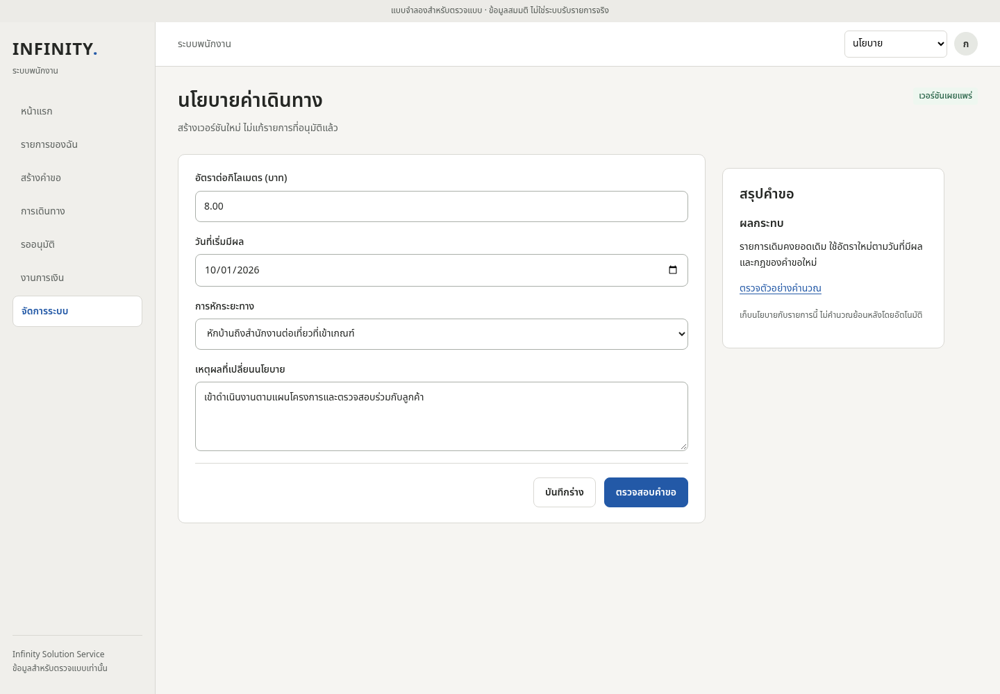
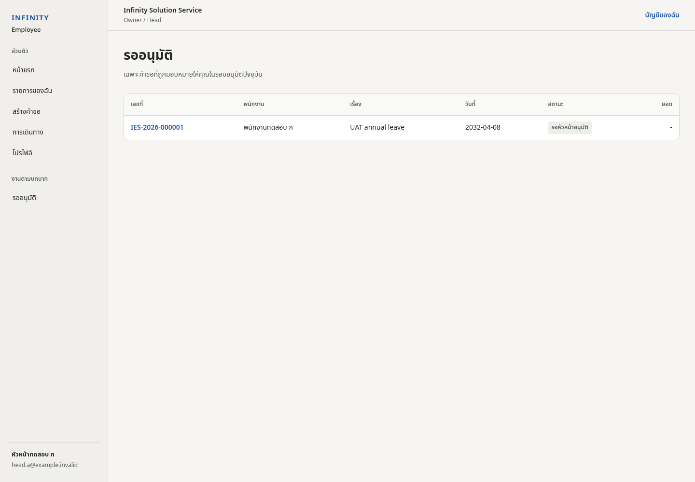
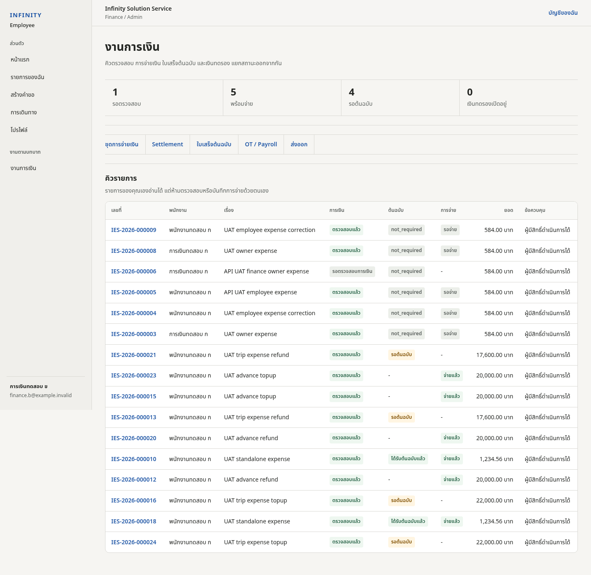
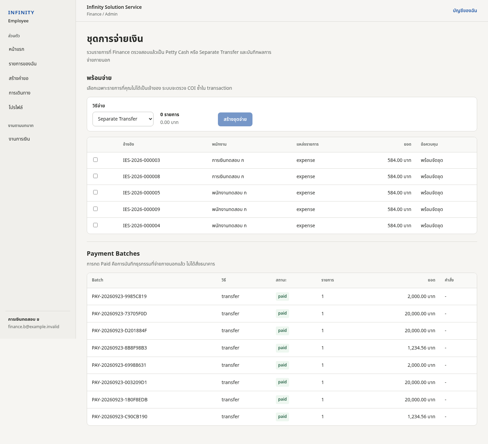
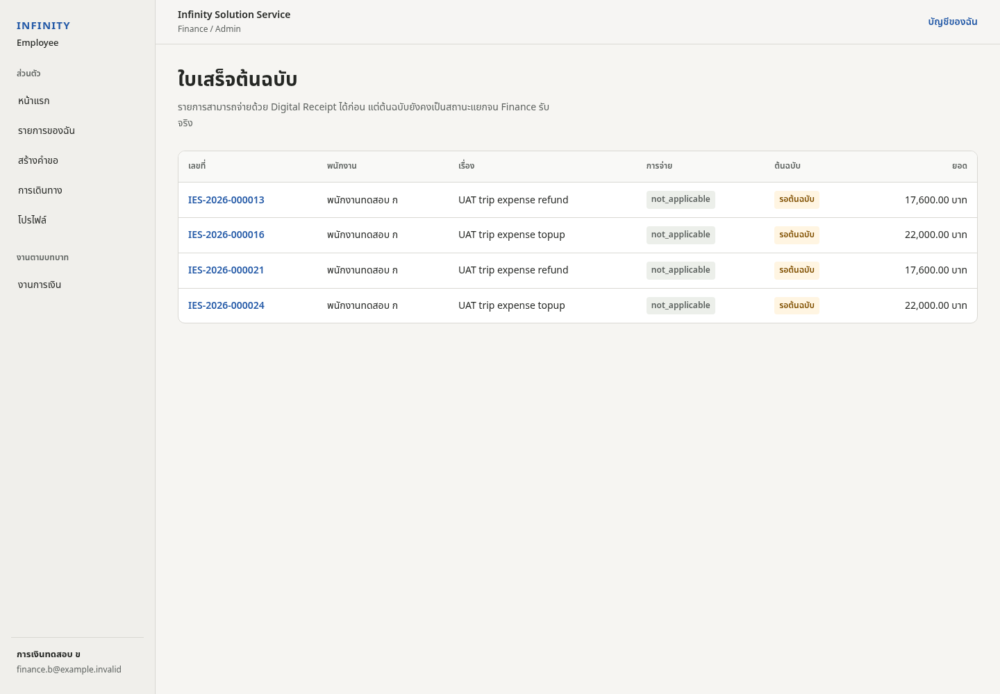
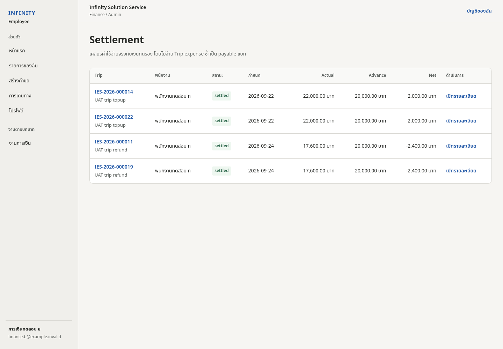
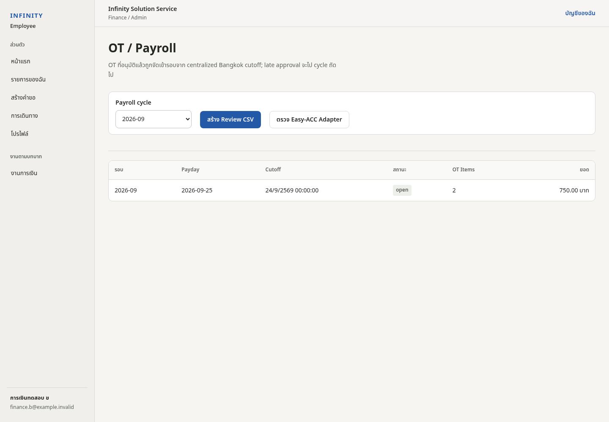
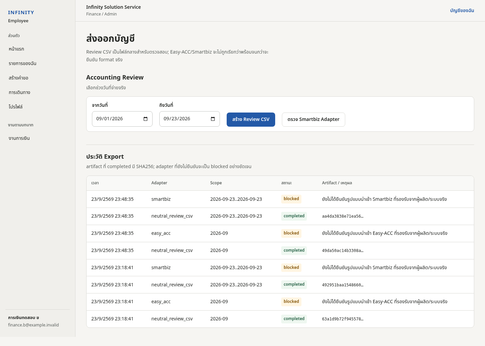

# คู่มือ Infinity Employee System — Admin และงานการเงิน

คู่มือนี้ใช้สำหรับผู้ดูแลระบบ, Finance, Finance Payer และ Head/Owner ที่ต้องทำงานด้าน Approval/Finance

> สิทธิ์ที่เห็นขึ้นอยู่กับ Role และ server-side authorization

---

# Part A — Admin

## 1. ภาพรวมงาน Admin

Admin ดูแล configuration หลัก:
- พนักงานและสิทธิ์
- Microsoft 365 Directory
- Department / Reporting Line
- Approval Rules
- Policy Center
- Project Integration

การเปลี่ยนแปลงที่มีผลต่อ workflow ควรตรวจ effective date และ audit history ก่อนบันทึก

---

## 2. พนักงานและสิทธิ์

Admin ใช้หน้าพนักงานเพื่อกำหนด:
- Department
- Employee role
- Head
- Finance
- Finance Payer
- Admin
- Head / Owner
- Active / inactive

### กฎสำคัญ
- Employee เป็น role พื้นฐาน
- Head/Owner มี Head behavior ตาม policy
- บัญชี Admin ที่กำลังใช้งานต้องไม่ทำให้ตนเองเสียสิทธิ์จนจัดการระบบต่อไม่ได้
- Finance และ Finance Payer ควรแยกตาม segregation of duties ที่บริษัทกำหนด

---

## 3. Microsoft 365 Directory

Directory Sync ใช้เพื่อ review identity จาก Microsoft 365 ก่อน map เป็น Employee

Admin ควรตรวจ:
- Account type: Member / Guest / service/resource
- Enabled state
- Employee link
- Department / Job
- Account ที่ไม่ใช่พนักงาน

### Workflow
1. กด Sync Microsoft 365
2. ตรวจ Enabled Members
3. เลือกบัญชีที่เป็นพนักงานจริง
4. map เข้ากับ Employee
5. กำหนด Department / Role เพิ่มเติมในหน้า Employee

Directory identity ไม่ควรสร้างสิทธิ์ Employee อัตโนมัติโดยไม่มี Admin review

---

## 4. Department และโครงสร้างองค์กร

ใช้สำหรับ:
- สร้าง Department
- เปลี่ยนชื่อ/สถานะ
- ดูจำนวนพนักงาน
- กำหนด Reporting Line

Reporting Line ใช้เป็น Manager Approval step หลัก

### Effective-dated change
เมื่อเปลี่ยน Head ให้กำหนดวันที่มีผล รายการใหม่จะใช้ Head ใหม่ ส่วนรายการในอดีตเก็บ snapshot เพื่อ audit

---

## 5. Approval Rules



Approval Rules ใช้กำหนด routing แยกตาม request type

แนวคิด:
1. ขั้นแรก: Reporting Line Head
2. Head/Owner self-request: `SYSTEM_SKIPPED`
3. Final Approver: กำหนดแยกตามประเภทได้
4. รายการที่เกี่ยวกับเงิน: ใช้ Finance / Finance Payer ตาม policy
5. การเปลี่ยนค่าใช้ effective date

### ตัวอย่างปลายทาง
- Leave → Approved
- OT → Payroll Queue
- Expense → Finance Verify → Finance Payer → Payment
- Trip → Approved Trip
- Cash Advance → Finance Verify / Payment / Settlement

---

## 6. Policy Center

ใช้จัดการ policy แบบ versioned/effective-dated เช่น:
- Working schedule
- Working days
- Office hours
- Lunch break
- Company holiday
- Leave
- OT
- Mileage
- Per diem
- Expense
- Payroll

### แนวทางการ publish
1. ตรวจค่าปัจจุบัน
2. กำหนด Effective Date
3. กรอกค่าใหม่
4. ตรวจผลกระทบ
5. Publish new version

ไม่ควรแก้ประวัติของ policy version ที่ถูกใช้กับ transaction แล้ว

---

## 7. Project Integration

Project Master ใช้ Microsoft Lists / SharePoint เป็น authority

Admin ใช้เพื่อตรวจ:
- Connection
- Last Sync
- Active / inactive
- จำนวน Project
- source rows
- missing Engineer Lead
- missing Cost Center

ระบบ group รายการที่มี PO เดียวกันให้เป็น Project เดียวใน UX แต่เก็บ source rows เพื่อ audit

---

# Part B — Approval

## 8. Approval Inbox



Head/Owner ใช้ Approval Inbox เพื่อตรวจคำขอที่ถูก assign ตาม reporting line/routing

### ขั้นตอน
1. เปิดรายการ
2. ตรวจผู้ขอ / ประเภท / Project / วันที่ / จำนวนเงิน
3. ตรวจหลักฐาน
4. Approve / Return / Reject ตามสิทธิ์และเหตุผล

### Return
ใช้เมื่อข้อมูลต้องแก้และต้องการให้พนักงาน Resubmit

### Reject
ใช้เมื่อคำขอไม่ควรดำเนินต่อ

Head/Owner ไม่ควร approve self-request ใน manager step; ระบบใช้ skip behavior ตาม policy

---

## 9. Approval Delegation

ใช้กรณีผู้อนุมัติไม่สามารถทำงานได้ช่วงหนึ่ง

กำหนด:
- ผู้รับมอบหมาย
- วันที่เริ่ม
- วันที่สิ้นสุด

Delegation ไม่ได้เปลี่ยน Reporting Line master และต้องเก็บ audit trail

---

# Part C — Finance

## 10. Finance Command Center



Flow หลัก:
1. ตรวจสอบรายการ
2. จัดชุดการจ่ายเงิน
3. OT / Payroll
4. Accounting Export

รายการของ Finance เองเป็น read-only ในขั้นที่เกิด conflict และห้าม Verify/Paid ด้วยตัวเอง

---

## 11. Finance Verify

Finance ตรวจ:
- ผู้ขอ
- ประเภทคำขอ
- Project
- จำนวนเงิน
- Receipt / Evidence
- Original receipt requirement
- Trip / Settlement relation
- policy snapshot

ถ้าข้อมูลครบจึง Verify เพื่อให้ workflow ไปขั้นถัดไป

ถ้าข้อมูลไม่ครบ ให้ Return ตาม flow ไม่ใช้การแก้ DB โดยตรง

---

## 12. Payment Batches



รายการที่ Finance Verify แล้วจะไป Ready to Pay

### วิธีใช้
1. เลือกวิธีจ่าย
2. เลือกรายการที่พร้อมจ่าย
3. สร้าง Payment Batch
4. ให้ Finance Payer ตรวจ
5. บันทึกผลการจ่าย
6. ตรวจสถานะ Paid

วิธีจ่ายอาจรวม:
- Petty Cash
- Separate Transfer
- Batch ตาม configuration

Finance ผู้เป็นเจ้าของรายการห้ามจ่ายรายการของตนเอง

---

## 13. Original Receipt



ใช้ติดตามเอกสารต้นฉบับที่ policy กำหนด

แยกจาก Digital Receipt:
- Digital evidence ใช้ประกอบ workflow
- Original receipt ใช้ติดตามเอกสารจริง

รายการสามารถ Paid ได้หรือไม่ขึ้นกับ policy/finance control ที่กำหนด

---

## 14. Cash Advance / Settlement



Settlement ใช้เคลียร์:
- Cash Advance
- Expense ที่เกิดระหว่าง Trip
- เงินคืนบริษัท / เงินต้องจ่ายเพิ่ม

Finance ต้องตรวจ relation กับ Trip และรายการ Expense ที่เกี่ยวข้องก่อนปิด Settlement

---

## 15. OT / Payroll



OT ที่อนุมัติครบจะเข้ารอบ Payroll ตาม Bangkok cutoff

### Finance ทำอะไร
1. ตรวจ Payroll cycle
2. ตรวจจำนวน OT item
3. ตรวจยอดรวม
4. Review export
5. ตรวจ readiness ของ EASY-ACC integration

### EASY-ACC
Employee System เป็นแหล่ง approved payroll input ไม่ใช่ payroll engine หลัก

EASY-ACC direct integration ยังต้อง fail closed จนกว่าจะมี sanctioned API/bridge contract และ authoritative mappings เช่น:
- Employee code
- Workday
- OT1–OT4 / income code
- cycle/cutoff mapping

ห้าม direct database write

---

## 16. Accounting Export / Smartbiz



Accounting Export ใช้เฉพาะรายการที่จ่ายแล้ว

### Review flow
1. เลือกช่วงวันที่
2. ตรวจรายการ Paid
3. สร้าง Review CSV
4. ตรวจ totals / reference
5. ตรวจสถานะ Smartbiz bridge

Smartbiz production integration ต้องใช้ sanctioned Desktop Bridge/import contract ของ edition ที่ติดตั้งจริง

ห้าม direct database write

---

## 17. Project P&L / Project Ledger

Finance/Admin เท่านั้นที่เห็นข้อมูลการเงิน Project

แนวคิด Margin:

```text
Current Margin = Revenue - Planned Cost - Actual Employee Cost
```

Finance ควรตรวจ:
- Revenue
- Planned Cost
- Actual Employee Cost
- Sale Cost / Engineer Cost / Entertainment / Hidden cost ตามข้อมูลที่รองรับ
- Margin / Margin %

Employee role ไม่ได้รับ financial projection จาก server query

---

## 18. Reconciliation

Reconciliation ใช้เทียบ:
- Payment item
- Payment batch
- Export
- Accounting posting
- Request / Expense reference

เมื่อยอดไม่ตรง ให้ตรวจ source transaction และ audit history ก่อนสร้าง adjustment

---

## 19. Monthly Closing

ก่อนปิดเดือนให้ตรวจ:
- Approval ค้าง
- Finance Verify ค้าง
- Payment ค้าง
- Receipt ต้นฉบับ
- Advance / Settlement
- Payroll cycle
- Accounting export
- Reconciliation exception

หลังปิดรอบไม่ควรย้อนแก้ transaction เดิมโดยตรง ให้ใช้ Adjustment workflow

---

## 20. Finance Operations / Needs Attention

ใช้รวม exception เช่น:
- เอกสารขาด
- mapping ขาด
- route/calendar review
- export blocked
- settlement overdue
- payment mismatch

ให้แก้ root cause ของรายการ ไม่ใช้ workaround เพียงเพื่อให้สถานะผ่าน

---

# Part D — Security / Audit

## 21. Segregation of Duties

ข้อบังคับหลัก:
- Finance ห้าม Verify รายการตนเอง
- Finance Payer ห้าม Paid รายการตนเอง
- Manager routing ยึด Reporting Line
- Head/Owner self-request manager step เป็น skip
- Financial Project data จำกัด Finance/Admin
- integration ที่ไม่พร้อมต้อง fail closed

---

## 22. Audit และ Effective Date

การเปลี่ยน configuration ที่สำคัญควรมี:
- Actor
- Timestamp
- Effective date
- Old / new value
- version/fingerprint ตาม subsystem ที่รองรับ

ใช้ audit เพื่ออธิบายว่า transaction หนึ่งใช้ policy/config รุ่นใด ณ วันที่เกิดรายการ

---

## 23. Troubleshooting

### Finance queue ไม่เจอรายการ
- ตรวจ request approval state
- ตรวจ finance state
- ตรวจว่า request type ต้องเข้า Finance หรือไม่
- ตรวจ conflict-of-interest

### Payment ไม่มีรายการ
- ต้อง Finance Verify ก่อน
- ตรวจ Ready to Pay
- ตรวจ Finance Payer routing

### Payroll ยังไม่มี cycle
- ตรวจ approved OT
- ตรวจ cutoff
- ตรวจ payroll policy

### EASY-ACC / Smartbiz ขึ้น blocked
เป็น fail-closed behavior จน sanctioned integration contract พร้อม ไม่ควร bypass

### Project financials ว่าง
- ตรวจ Project Master
- ตรวจ Project grouping
- ตรวจ role Finance/Admin
- ตรวจ source Revenue/Cost mapping

---

## 24. Checklist ก่อนปิดงาน Finance ประจำวัน

- [ ] Queue Finance ตรวจครบ
- [ ] รายการของตนเองไม่มีการ Verify/Paid โดยตนเอง
- [ ] Ready to Pay ถูกจัดการ
- [ ] Payment Batch ที่จ่ายแล้วบันทึกผลครบ
- [ ] Original Receipt backlog ถูกติดตาม
- [ ] Cash Advance/Settlement ถูกติดตาม
- [ ] Payroll/Export exception ถูก review
- [ ] Needs Attention ไม่มีรายการสำคัญค้างโดยไม่ทราบสาเหตุ
