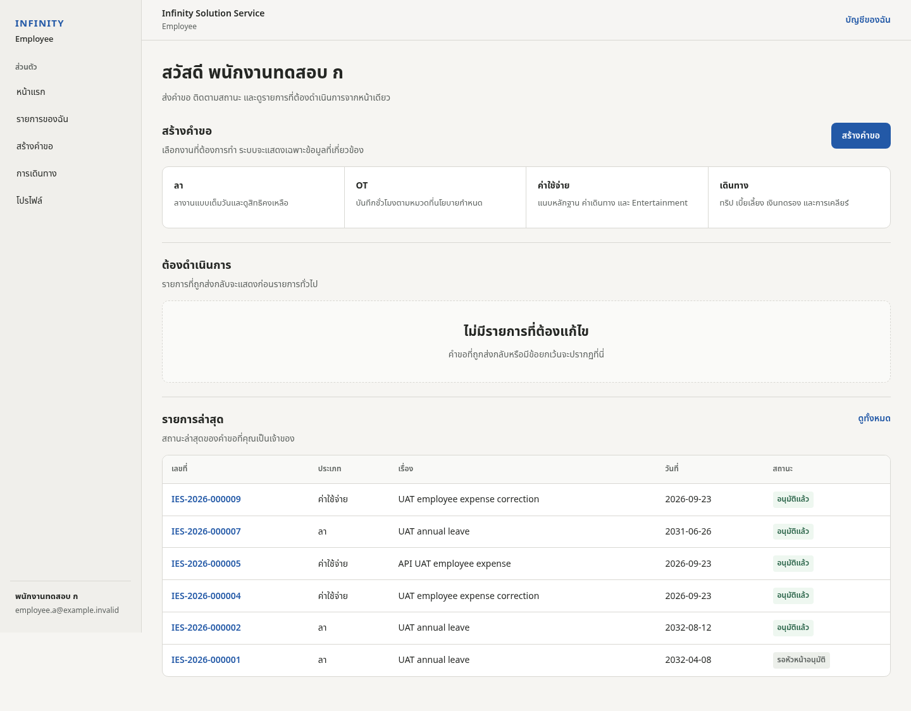
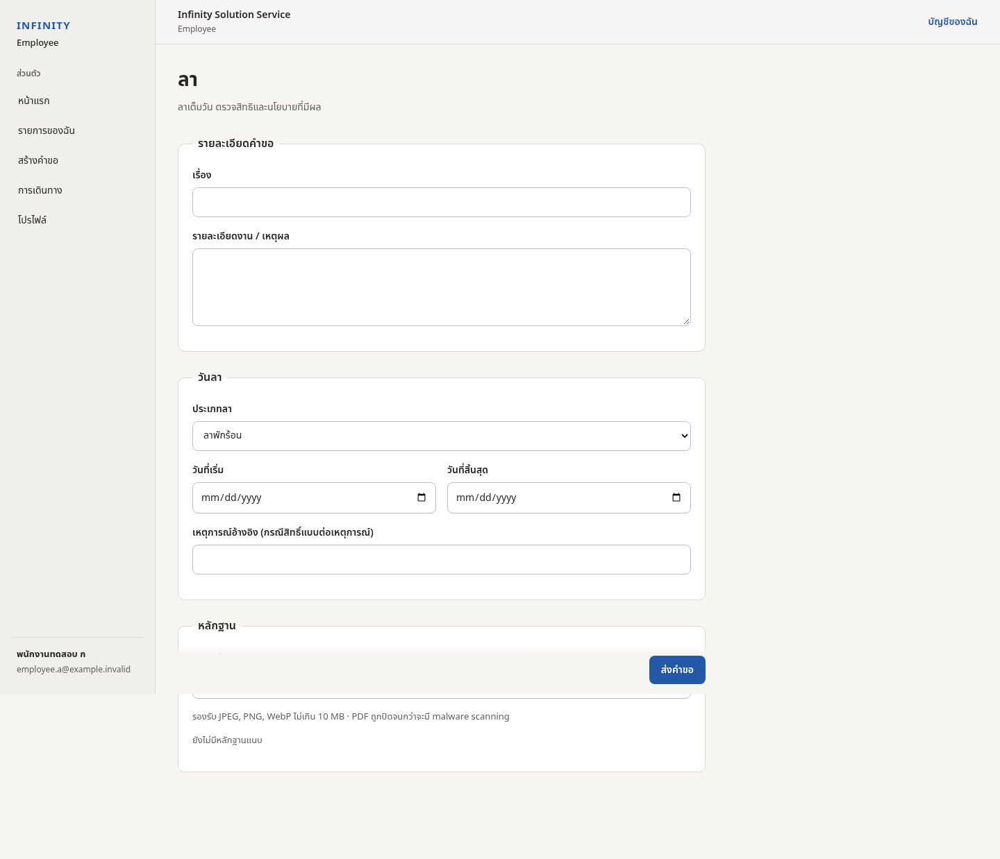
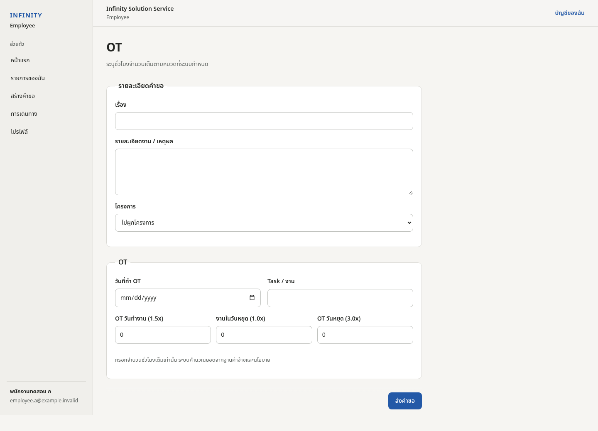
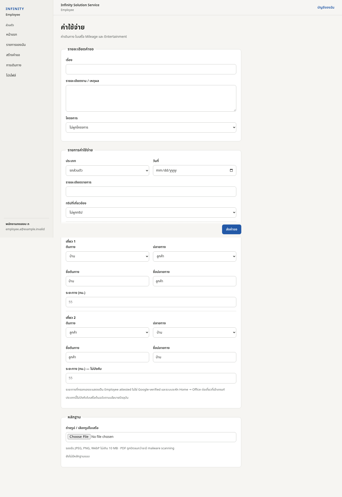
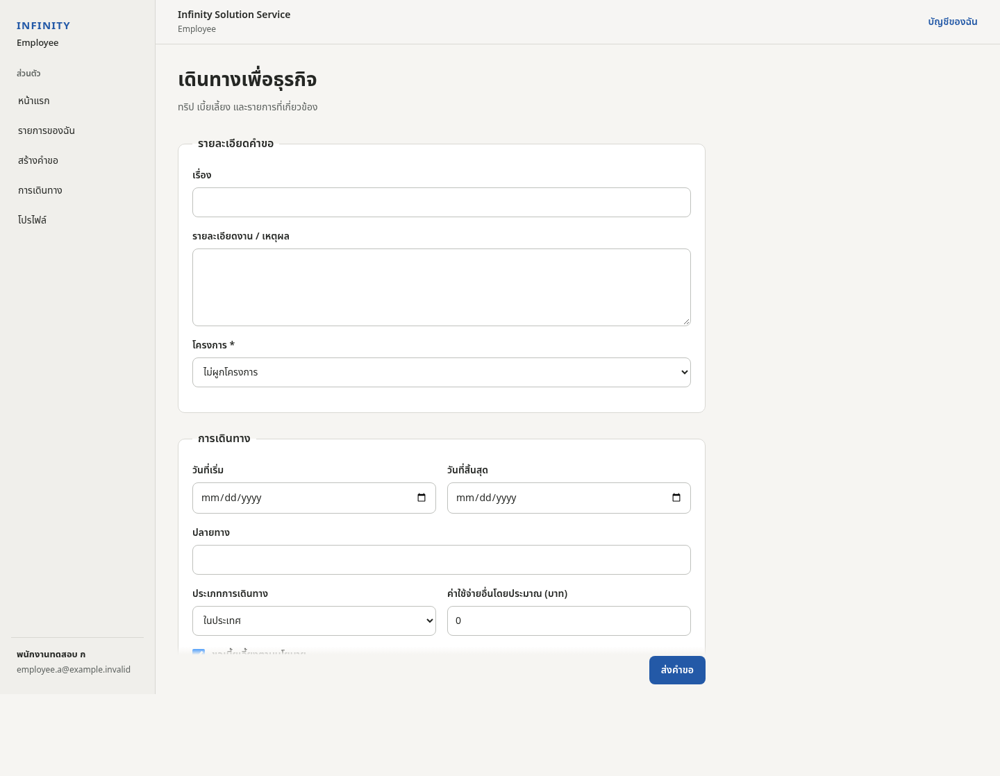
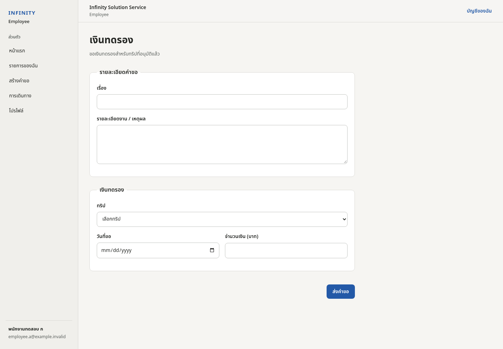
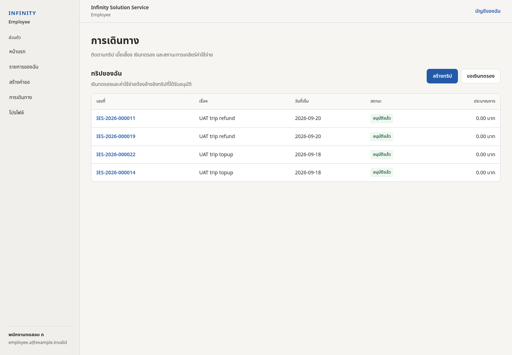
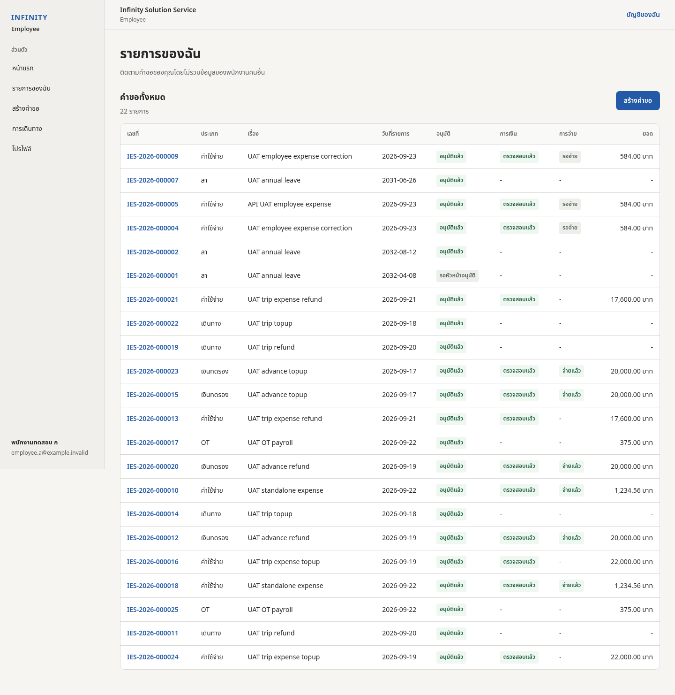
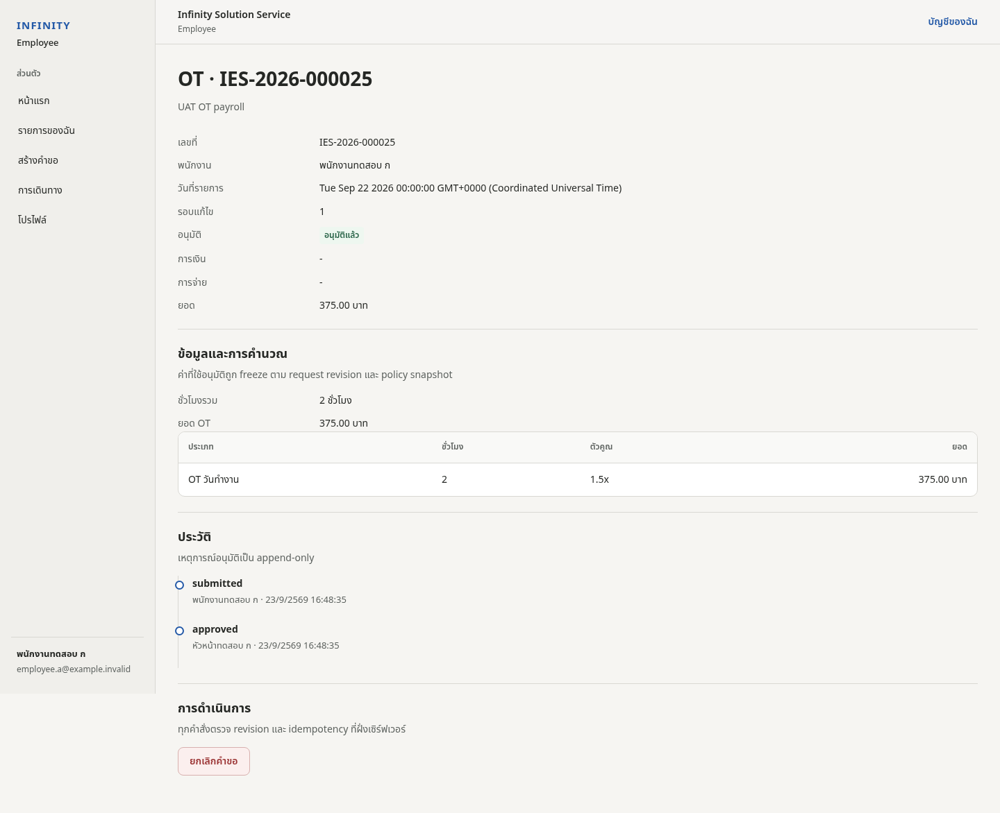

# คู่มือการใช้งาน Infinity Employee System — พนักงานทั่วไป

ฉบับนี้อธิบายการใช้งานสำหรับพนักงานทั่วไป ตั้งแต่หน้าหลัก การสร้างคำขอ การติดตามสถานะ การใช้ Outlook Calendar Inbox, Mileage, Receipt Inbox, Business Trip, Cash Advance และรายงานรายเดือน

> เมนูที่ผู้ใช้เห็นจริงขึ้นอยู่กับ Role ของบัญชี และข้อมูลตัวอย่างในภาพเป็น UAT / synthetic data

---

## 1. หน้าหลัก

หน้าหลักเป็นจุดเริ่มต้นของงานประจำวัน ใช้สำหรับดู Quick Action, งานจาก Outlook, คำขอล่าสุด และสรุปการใช้งานประจำเดือน

### สิ่งที่ควรดูบนหน้าหลัก
- **ขออนุมัติลา** — เริ่มคำขอลา
- **ขอ OT** — เริ่มคำขอทำงานล่วงเวลา
- **เบิกค่าใช้จ่าย** — Expense / Mileage / Taxi / Grab / Toll ฯลฯ
- **ขออนุมัติเดินทาง** — Business Trip
- **ปฏิทินงานของฉัน (Outlook)** — งานที่ sync จาก Outlook
- **คำขอล่าสุดของฉัน** — สถานะคำขอที่เพิ่งส่ง
- **สรุปการใช้งานเดือนนี้** — OT / Leave / Expense เชิง operational

---

## 2. สร้างคำขอใหม่

เข้าเมนู **ขออนุมัติ** แล้วเลือกประเภทคำขอ ระบบจะแสดงเฉพาะ field ที่เกี่ยวข้องกับประเภทที่เลือก

ประเภทหลัก:
1. ลา
2. OT
3. ค่าใช้จ่าย / ค่ารถ
4. เดินทางไปปฏิบัติงาน
5. เงินทดรอง

### หลักการก่อนส่ง
- ตรวจเรื่องและเหตุผลให้ชัด
- เลือก Project ให้ถูกต้องถ้าคำขอเกี่ยวข้องกับ Project
- ตรวจวันที่และจำนวนเงิน
- แนบหลักฐานตาม policy
- ตรวจข้อมูลอีกครั้งก่อนกด **ส่งคำขอ**

---

## 3. การลา

### ขั้นตอน
1. กรอก **เรื่อง**
2. กรอก **รายละเอียดงาน / เหตุผล**
3. เลือกประเภทลา
4. เลือกวันที่เริ่มและวันสิ้นสุด
5. แนบหลักฐานเมื่อ policy กำหนด
6. ตรวจข้อมูล
7. กด **ส่งคำขอ**

### ข้อควรทราบ
- ระบบรองรับการลาแบบเต็มวัน
- จำนวนวันและสิทธิยึดตาม policy ที่มีผลในวันของรายการ
- คำขอ Head/Owner อาจข้าม Manager step ตาม policy
- ถ้าคำขอถูก Return ให้เปิดเหตุผล แก้ข้อมูล และ Resubmit

---

## 4. OT

### ขั้นตอน
1. กรอกเรื่อง / รายละเอียด
2. เลือก Project ถ้าเกี่ยวข้อง
3. เลือกวันที่ OT
4. ระบุ Task / งาน
5. กรอกชั่วโมงตามประเภท OT
6. ตรวจข้อมูล
7. กด **ส่งคำขอ**

### หน่วยชั่วโมง
- ขั้นต่ำ 0.5 ชั่วโมง
- เพิ่มทีละ 0.5 ชั่วโมง
- ประเภท multiplier ที่แสดงให้เลือกขึ้นอยู่กับ policy

เมื่ออนุมัติครบ OT จะเข้าสู่ Payroll Queue ตามรอบ cutoff

---

## 5. ค่าใช้จ่าย / ค่ารถ

Expense รองรับหลายรายการในคำขอเดียว และแต่ละรายการสามารถมีหลักฐานของตนเอง

ตัวอย่างหมวด:
- รถส่วนตัว / Mileage
- Taxi
- Grab
- Toll
- Parking
- Rental Car
- Fuel
- Hotel
- Entertainment
- Other

### ขั้นตอนทั่วไป
1. กรอกเรื่องและเหตุผล
2. เลือก Project ถ้ามี
3. เพิ่ม Expense line
4. เลือกประเภท
5. กรอกวันที่ / จำนวนเงิน / รายละเอียด
6. เลือกหรืออัปโหลดใบเสร็จตาม policy
7. ตรวจยอดรวม
8. ส่งคำขอ

---

## 6. Mileage และ Google Maps

สำหรับรถส่วนตัว ระบบใช้ Route เพื่อช่วยคำนวณระยะทางและเก็บข้อมูลประกอบการเบิกตาม policy

### ขั้นตอน
1. เลือกต้นทาง เช่น บ้าน / Office / ลูกค้า
2. เลือกปลายทาง
3. กรอกหรือเลือกที่อยู่
4. ให้ระบบคำนวณ route
5. เลือกเส้นทางที่ใช้จริง
6. ตรวจระยะทาง
7. ระบุค่าทางด่วน ถ้ามี
8. แนบหลักฐานที่ policy กำหนด
9. ตรวจค่า Mileage ก่อนส่ง

### Home Address / Commute Baseline
- Home Address ใช้เฉพาะ workflow Mileage
- Commute Baseline ใช้หักระยะทางตาม policy เฉพาะกรณีที่เกี่ยวข้อง
- Office → Customer ไม่ควรถูกหัก commute แบบ Home leg

### การดูแผนที่
- ใช้ปุ่ม **− / +** เพื่อย่อหรือขยายภาพ
- ใช้ **ขยายกรอบ / ย่อกรอบ** เพื่อเปลี่ยนพื้นที่แสดงแผนที่
- การ zoom เป็นการแสดงผลฝั่ง client ไม่เปลี่ยน route ที่เลือก

### Privacy
ข้อมูลบ้านใช้เพื่อคำนวณ Mileage เท่านั้น ไม่ควรแสดงใน Project หรือรายงานสาธารณะ

---

## 7. Receipt Inbox

Receipt Inbox ใช้สำหรับอัปโหลดใบเสร็จก่อน แล้วค่อยเลือกไปผูกกับ Expense line

### วิธีใช้
1. เข้าเมนู **ใบเสร็จ**
2. อัปโหลด JPEG / PNG / WebP / PDF ตามข้อจำกัดระบบ
3. ใบเสร็จที่ยังไม่ใช้จะอยู่ใน Inbox
4. ตอนสร้าง Expense ให้เลือกใบเสร็จที่ต้องการ
5. เมื่อผูกและ Submit แล้ว ใบเสร็จจะไม่เป็น unassigned อีก

ไฟล์ PDF หรือไฟล์ที่ต้องตรวจเพิ่มอาจผ่าน malware scanning ก่อนใช้งาน

---

## 8. Business Trip

### ต้องระบุ
- เรื่อง / เหตุผล
- Project
- วันเริ่ม
- วันสิ้นสุด
- ปลายทาง
- ในประเทศ / ต่างประเทศ
- ค่าใช้จ่ายโดยประมาณ
- เบี้ยเลี้ยงตาม policy

Trip เป็น parent สำหรับ Expense / Cash Advance / Settlement ที่เกี่ยวข้อง

---

## 9. เงินทดรอง (Cash Advance)

### ขั้นตอน
1. เลือก Trip ที่อนุมัติแล้ว
2. ระบุวันที่ขอ
3. ระบุจำนวนเงิน
4. กรอกเหตุผล
5. ตรวจยอด
6. ส่งคำขอ

หลังการเดินทางต้องดำเนินการ Settlement ตาม policy ภายในเวลาที่กำหนด

---

## 10. การเดินทางของฉัน

ใช้หน้าการเดินทางเพื่อตรวจ:
- เลขที่ Trip
- เรื่อง
- วันที่เดินทาง
- สถานะ
- ยอดประมาณการ

จากหน้านี้สามารถเริ่ม Trip ใหม่หรือขอ Cash Advance ตาม flow ได้

---

## 11. คำขอของฉัน

หน้า **คำขอของฉัน** แสดงเฉพาะข้อมูลของผู้ใช้ปัจจุบัน

ข้อมูลสำคัญ:
- เลขที่
- ประเภท
- เรื่อง
- วันที่รายการ
- Approval state
- Finance state
- Payment state
- ยอด

### สถานะหลักที่พบบ่อย

| สถานะ | ความหมาย |
|---|---|
| Draft | ยังไม่ส่งเข้าสู่ workflow |
| Pending Head | รอ Head/Reporting Line |
| Pending Final | รอ Final Approver |
| Returned | ถูกส่งกลับให้แก้ไข |
| Approved | อนุมัติครบแล้ว |
| Finance Verify | รอ Finance ตรวจ |
| Ready to Pay | พร้อมเข้าชุดจ่าย |
| Paid | บันทึกจ่ายแล้ว |

---

## 12. รายละเอียดคำขอ

เมื่อเปิดคำขอจะเห็น:
- ข้อมูลคำขอ
- Project
- รายละเอียดตามประเภท
- Approval history
- Finance / Payment status
- Document / Receipt
- Audit-relevant timestamps

ถ้าคำขอถูก Return ให้แก้ข้อมูลตามเหตุผลแล้ว Resubmit

---

## 13. Outlook Calendar Inbox

ระบบอ่านเฉพาะ Outlook event ที่มี Category ตามรูปแบบ `IES · ...`

ตัวอย่าง:
- `IES · OT`
- `IES · Onsite`
- `IES · ลาป่วย`
- `IES · ลาพักร้อน`

### หลักการ
- Calendar event เป็น Draft / Suggestion
- ไม่ส่งอนุมัติอัตโนมัติ
- ผู้ใช้ต้อง Review ก่อน
- Event ส่วนตัวที่ไม่มี Category ที่กำหนดไม่ควรเข้าระบบ

### Workflow
1. ตั้ง Category ใน Outlook
2. Sync Calendar
3. เปิด Calendar Inbox
4. Confirm / Ignore / Review
5. ตรวจข้อมูลที่ระบบแนะนำ
6. สร้างคำขอ
7. ตรวจอีกครั้งก่อน Submit

---

## 14. Monthly Operational Statement

รายงานรายเดือนแสดงภาพรวมเชิง operation เช่น:
- ชั่วโมง OT
- Mileage
- Leave
- Expense
- Advance / Settlement
- สถานะการจ่าย

> รายงานนี้ **ไม่ใช่ Payslip**

รายการหลังปิดรอบต้องใช้ Adjustment ตาม workflow แทนการแก้ประวัติย้อนหลังโดยตรง

---

## 15. Notifications

Notification ใช้แจ้งเหตุการณ์ที่ผู้ใช้ควรทราบ เช่น:
- คำขออนุมัติแล้ว
- Calendar Draft ต้อง Review
- Original Receipt ยังขาด
- Finance queue / payment ที่เกี่ยวข้อง

อ่านข้อความแล้วสามารถเปิดรายการต้นทางจาก notification ได้

---

## 16. Needs Attention

Needs Attention รวมรายการที่ต้องแก้หรือตรวจเพื่อให้ workflow เดินต่อ

ตัวอย่าง:
- Calendar time range review
- รอใบเสร็จต้นฉบับ
- ข้อมูลที่ต้องเติม
- Exception ที่ระบบตรวจพบ

ให้เปิดแต่ละรายการและทำ action ตามข้อความบนหน้าจอ

---

## 17. Profile / Home Address

Home Address ใช้สำหรับ Mileage เท่านั้น

### การตั้งค่า
1. เปิด Profile
2. กรอก Home Address
3. บันทึก
4. กรอก Commute Baseline Home → Office ถ้านโยบายบริษัทกำหนด
5. บันทึก effective value

ควรใช้ระยะทางที่ตรวจสอบแล้ว เพราะค่าปัจจุบันจะถูกใช้กับ Mileage ใหม่ตาม effective date

---

## 18. การใช้งานบนมือถือ

ภาพ UAT mobile:
- [หน้าหลัก 390px](../../evidence/app-uat/employee-home-390.png)
- [คำขอของฉัน 390px](../../evidence/app-uat/employee-requests-390.png)
- [Expense 390px](../../evidence/app-uat/employee-new-expense-390.png)

คำแนะนำ:
- ใช้ browser ที่อัปเดตล่าสุด
- ตรวจ Project และจำนวนเงินก่อน Submit
- ภาพ/ใบเสร็จควรถ่ายให้ชัดก่อน upload
- ถ้าฟอร์มยาว ให้ตรวจทุก section ก่อนกดส่ง

---

## 19. Troubleshooting สำหรับพนักงาน

### Calendar ไม่ขึ้น
- ตรวจ Category ว่าเป็น `IES · ...`
- กด Sync
- เปิด Calendar Inbox
- ถ้ายังไม่ขึ้น ตรวจว่า event อยู่ใน Calendar ของบัญชีที่ login อยู่

### Project หาไม่เจอ
- ลองค้นด้วย PO / Project / Customer / Product
- Project Master อาจยังไม่ได้ sync ล่าสุด
- ติดต่อ Admin ถ้า source project ไม่มีจริง

### Mileage ไม่คำนวณ
- ตรวจต้นทาง/ปลายทาง
- ตรวจ Home Address ถ้าใช้ “บ้าน”
- เลือก route ใหม่
- ตรวจ Google Maps service status

### ใบเสร็จเลือกไม่ได้
- ตรวจว่าใบเสร็จยังเป็น unassigned
- ตรวจชนิด/ขนาดไฟล์
- รอ malware scan ถ้าระบบกำลังประมวลผล

### คำขอถูก Return
- เปิดรายละเอียด
- อ่านเหตุผล
- แก้เฉพาะข้อมูลที่เกี่ยวข้อง
- Resubmit

---

## 20. Checklist ก่อนส่งคำขอ

- [ ] เรื่องและเหตุผลถูกต้อง
- [ ] Project ถูกต้อง
- [ ] วันที่ถูกต้อง
- [ ] ชั่วโมง / จำนวนเงินถูกต้อง
- [ ] Route ถูกต้อง
- [ ] ใบเสร็จ / หลักฐานครบ
- [ ] Trip ถูกผูกถูกต้อง (ถ้ามี)
- [ ] ตรวจข้อมูลอีกครั้งก่อน Submit
